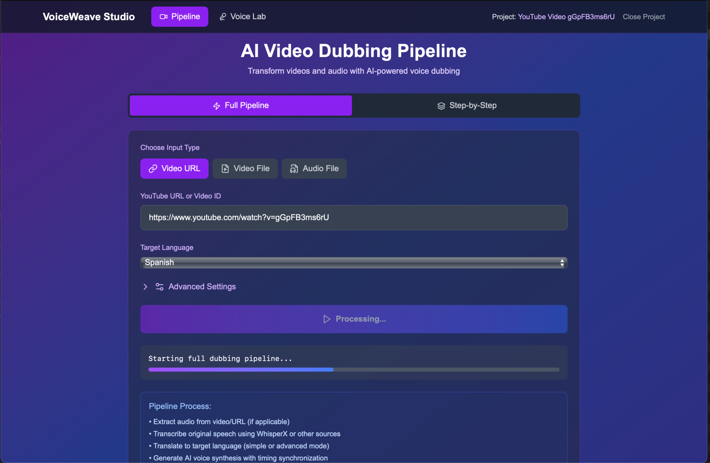
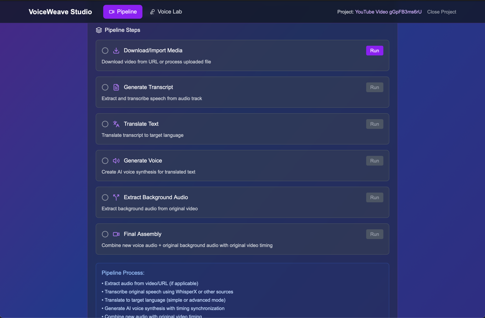
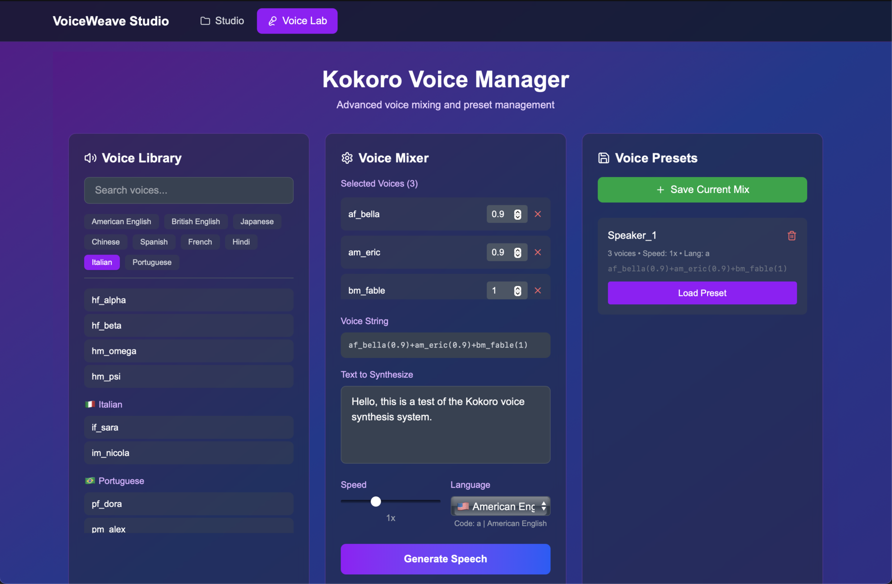
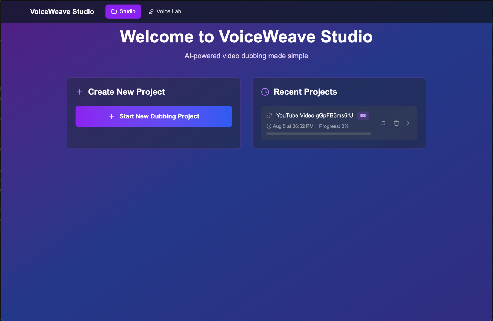

# VoiceWeave Studio
> AI-powered video dubbing pipeline - weaving voices across languages

Transform any video into natural, culturally-aware dubbing by seamlessly weaving voices across languages using advanced AI translation and high-quality voice synthesis.

## Demo
<video width="480" controls>
  <source src="screenshots/demo.mp4" type="video/mp4">
  Your browser does not support the video tag.
</video>

## Requirements
- Python 3.9+ (tested with 3.12.3)
- Go 1.18+ (tested with 1.24.3)
- FFmpeg
- Hugging Face token (optional, for speaker diarization)
- Claude API key (for translation)

## 📸 Screenshots

Click to view more screenshots

### Full Pipeline View

### Step-by-Step Process

### Voice Management

### Welcome Screen - Project Manager

## ⚖️ License

VoiceWeave Studio is licensed under the **GNU Affero General Public License v3.0 (AGPL-3.0)**.

- ✅ **Free for open source projects** - Use, modify, and distribute freely
- ✅ **Community contributions** - All improvements must be shared back
- ⚠️ **Network use requires disclosure** - If you deploy VoiceWeave Studio as a service, you must open source your changes
- 💼 **Commercial licensing available** - Contact us for proprietary use licensing

## 🏢 Commercial Licensing

VoiceWeave Studio is available under AGPL-3.0 for open source use.

For commercial licensing inquiries or consulting opportunities:
Contact: async.v99@gmail.com